# FoT real50 图片对比表

每行对应一张冻结测试图片。列顺序为原图、保护图、SVD 最后一帧、原始置信度图和恢复图。
缩略图只用于 GitHub 浏览；正式指标使用 LDS 上的全分辨率文件计算。
Confidence 保留原始显示范围，没有为了变亮而重新归一化，因此低置信度图会接近黑色。

- 样本数：50；
- 生成时间（UTC）：`2026-08-26T12:28:09.865626+00:00`；
- checkpoint SHA-256：`670b6f8f354917e7f9ffffbbc8f3ef20363bdbbada73344d2925af90478e6c59`；
- 数据清单 SHA-256：`37aafda0707efeabd1c65120b55886e34367f62efc9c1180ce7735fe7f7dadf5`；
- 完整性状态：PASS。

## Animal

| ID | Original | Protected | Forged | Confidence | Recovered |
| --- | --- | --- | --- | --- | --- |
| `animal_01` |  | 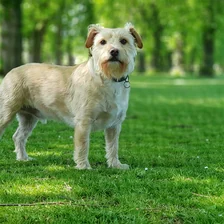 |  |  |  |
| `animal_02` |  |  |  |  |  |
| `animal_03` |  | 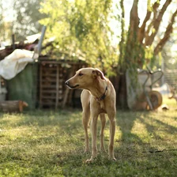 | 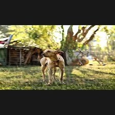 |  | 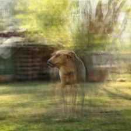 |
| `animal_04` |  |  |  |  |  |
| `animal_05` | 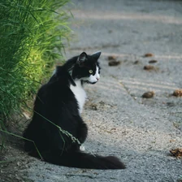 | 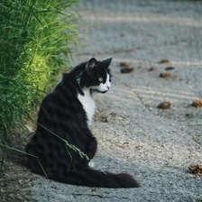 | 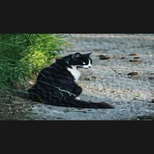 |  |  |
| `animal_06` | 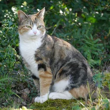 | 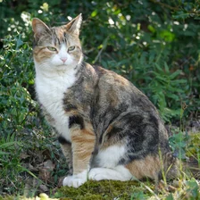 |  |  | 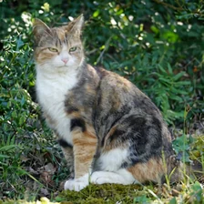 |
| `animal_07` |  |  |  |  |  |
| `animal_08` |  |  |  |  |  |
| `animal_09` |  | 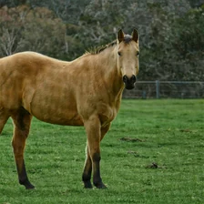 | 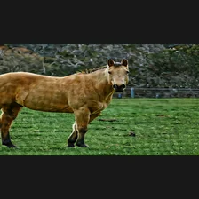 |  |  |
| `animal_10` | 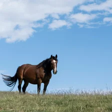 |  |  |  | 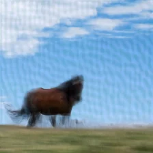 |

## Camera

| ID | Original | Protected | Forged | Confidence | Recovered |
| --- | --- | --- | --- | --- | --- |
| `camera_01` |  |  | 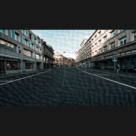 |  | 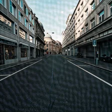 |
| `camera_02` |  | 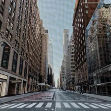 | 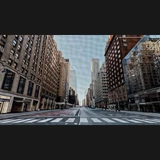 |  |  |
| `camera_03` |  |  |  |  | 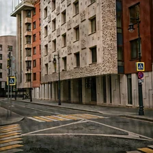 |
| `camera_04` | 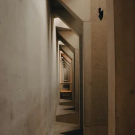 | 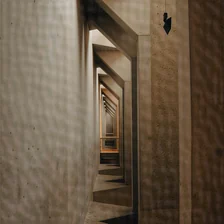 | 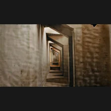 |  | 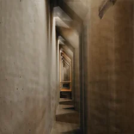 |
| `camera_05` |  |  |  |  |  |
| `camera_06` |  | 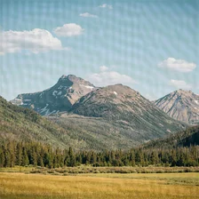 |  |  |  |
| `camera_07` |  |  |  |  |  |
| `camera_08` |  |  |  |  |  |
| `camera_09` | 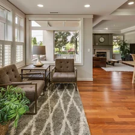 |  | 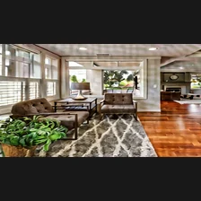 |  |  |
| `camera_10` | 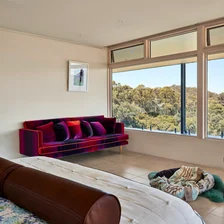 |  | 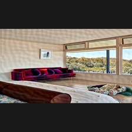 |  |  |

## Face

| ID | Original | Protected | Forged | Confidence | Recovered |
| --- | --- | --- | --- | --- | --- |
| `face_01` |  |  |  | 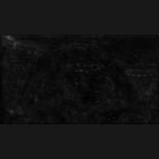 |  |
| `face_02` |  |  |  |  |  |
| `face_03` |  |  |  |  |  |
| `face_04` |  |  |  |  |  |
| `face_05` |  |  |  |  |  |
| `face_06` |  |  |  |  |  |
| `face_07` |  |  |  |  |  |
| `face_08` |  |  |  |  |  |
| `face_09` |  |  |  |  |  |
| `face_10` |  |  |  |  |  |

## Human-Environment

| ID | Original | Protected | Forged | Confidence | Recovered |
| --- | --- | --- | --- | --- | --- |
| `human_environment_01` |  |  |  |  |  |
| `human_environment_02` |  |  |  |  |  |
| `human_environment_03` |  |  |  |  |  |
| `human_environment_04` |  |  |  |  |  |
| `human_environment_05` | 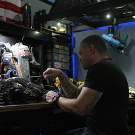 | 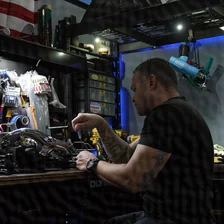 |  |  | 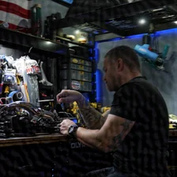 |
| `human_environment_06` |  |  |  |  |  |
| `human_environment_07` |  |  |  |  |  |
| `human_environment_08` |  |  |  |  |  |
| `human_environment_09` |  |  |  |  |  |
| `human_environment_10` |  |  | 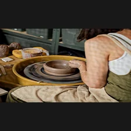 |  |  |

## Multi-Human

| ID | Original | Protected | Forged | Confidence | Recovered |
| --- | --- | --- | --- | --- | --- |
| `multi_human_01` |  |  |  |  |  |
| `multi_human_02` |  |  |  |  |  |
| `multi_human_03` |  |  |  |  |  |
| `multi_human_04` |  |  |  |  |  |
| `multi_human_05` |  |  |  |  |  |
| `multi_human_06` |  |  |  |  |  |
| `multi_human_07` |  |  |  |  |  |
| `multi_human_08` |  |  |  |  |  |
| `multi_human_09` |  | 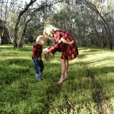 | 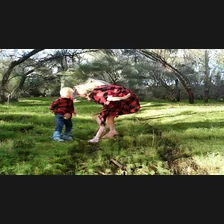 |  | 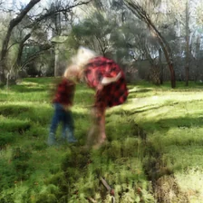 |
| `multi_human_10` |  |  |  |  |  |

## 审计文件

- [`comparison_manifest.csv`](comparison_manifest.csv)：便于表格软件查看；
- [`comparison_manifest.json`](comparison_manifest.json)：尺寸、亮度、来源及缩略图哈希；
- [`comparison_generation.log`](comparison_generation.log)：逐张生成日志和源文件 SHA-256。
